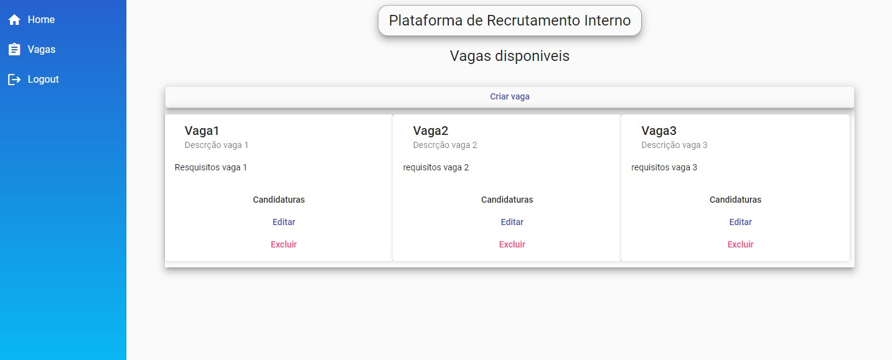

# Sistema de Recrutamento Interno - Frontend
Esta é uma aplicação web criada para facilitar o processo de recrutamento interno para os colaboradores da empresa.

### Tecnologias Utilizadas
* Angular 13.1.2

### Funcionalidades
* Autenticação e autorização
* Interação com o backend para cadastro e gerenciamento de vagas

### Como Executar
* Clone e execute o projeto [`Back-end`](https://github.com/felipesousa7/internal-recruitment-api)
* Clone este repositório.
* Instale as dependências usando `npm install`
* Execute o projeto com `ng serve`
* Acesse a aplicação em `http://localhost:4200`

### Estrutura do Projeto
* auth/auth.guard: Guarda de rota para verificar autenticação do usuário antes de acessar páginas protegidas.
* components/header: Componente para exibir o cabeçalho da página, com opções de navegação e autenticação.
* components/home: Página inicial da aplicação, exibindo informações gerais.
* components/job: Componente para exibir detalhes de uma vaga de emprego.
* components/login: Página de login para autenticar usuários.
* components/nav: Componente de navegação para facilitar a transição entre páginas.
* components/register: Página de registro para novos usuários se cadastrarem.
* config/api.config: Configuração para URL base da API e outras configurações de conexão.
* interceptors/authinterceptor: Interceptor para adicionar token JWT às requisições HTTP (autenticação).
* models: Classes TypeScript para representar dados, como usuário, vaga de emprego, etc.
* services: Serviços Angular para acessar a API, autenticar usuários, gerenciar vagas de emprego, etc.

